# Laboratorio Kubernetes con kubeadm

## Despliegue, exposición, escalamiento y resiliencia de una aplicación

## 1. Información general

**Asignatura:** Infraestructura III  
**Tema:** Orquestación de contenedores con Kubernetes  
**Entorno:** Clúster Kubernetes desplegado previamente con `kubeadm` sobre VirtualBox  
**Modalidad:** Individual

## 2. Objetivo del laboratorio

Desplegar, exponer y gestionar una aplicación contenerizada en un clúster Kubernetes real, validando su funcionamiento operativo mediante el uso de manifiestos YAML, `Deployment`, `Service`, escalamiento manual y prueba de auto-recuperación.

---

## 3. Requisitos previos

Antes de iniciar el laboratorio se contó con:

- Clúster Kubernetes funcional
- Acceso al nodo `control plane`
- `kubectl` configurado
- `git` instalado

---

## 4. Clonación del repositorio

Se trabajó con el siguiente repositorio:

```bash
git clone https://github.com/mariocr73/K8S-apps.git
cd K8S-apps
```

<p align="center">
  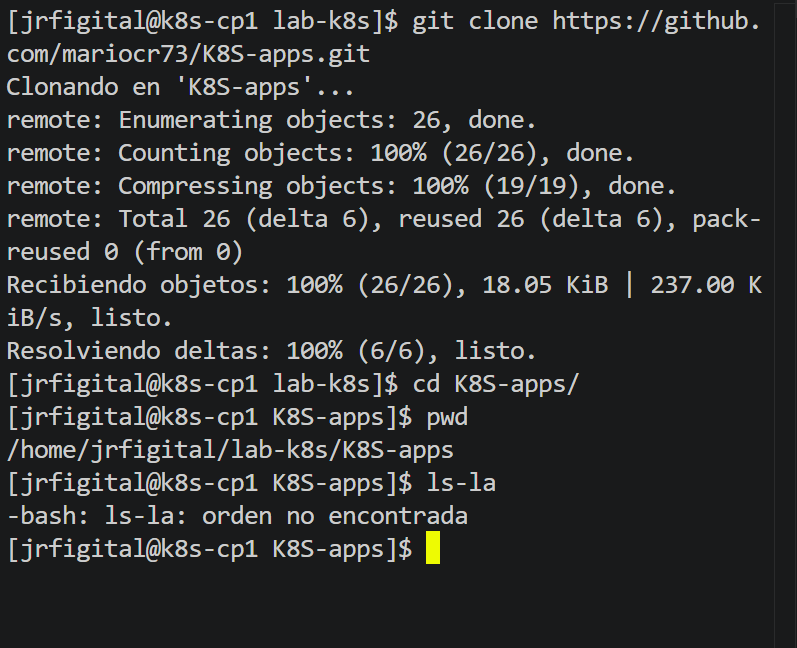
</p>

Este repositorio contiene el código fuente de una aplicación sencilla en Flask, junto con los manifiestos YAML necesarios para desplegarla en Kubernetes.

---

## 5. Validación inicial del clúster

Antes de desplegar la aplicación, se verificó el estado del clúster con el comando:

```bash
kubectl get nodes
```

<p align="center">
  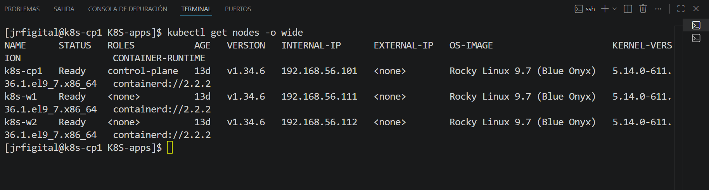
</p>

El resultado fue correcto, ya que los nodos del clúster se encontraban en estado `Ready`, lo que confirmó que el entorno estaba operativo para continuar con la práctica.

---

## 6. Análisis de los archivos YAML del repositorio

Dentro del proyecto se identificaron varios archivos YAML con diferentes funciones dentro de Kubernetes.

### Clasificación de recursos

| Archivo                  | Tipo de recurso | Función                                         |
| ------------------------ | --------------- | ----------------------------------------------- |
| `webapp-deployment.yaml` | Deployment      | Despliega y administra la aplicación            |
| `webapp-service.yaml`    | Service         | Expone la aplicación dentro o fuera del clúster |
| `webapp-replicaset.yaml` | ReplicaSet      | Mantiene una cantidad definida de pods          |
| `webapp-configmap.yaml`  | ConfigMap       | Guarda configuración no sensible                |
| `webapp-dhsecret.yaml`   | Secret          | Permite manejar credenciales o datos sensibles  |

### Explicación técnica

- **Deployment:** se encarga de administrar los pods de la aplicación y mantener el número deseado de réplicas.
- **Service:** permite acceder a la aplicación, incluso si los pods cambian o se recrean.
- **ReplicaSet:** garantiza que exista una cantidad determinada de pods.
- **ConfigMap:** almacena variables o configuraciones no sensibles.
- **Secret:** se utiliza para credenciales o datos sensibles.

### Respuesta a la pregunta obligatoria

**¿Por qué en Kubernetes se recomienda usar Deployment en lugar de crear Pods directamente?**

Se recomienda usar `Deployment` porque permite administrar el estado deseado de la aplicación. Si un pod falla o es eliminado, Kubernetes lo recrea automáticamente. Además, el Deployment facilita el escalamiento, las actualizaciones y el control de réplicas, mientras que crear pods directamente no ofrece ese nivel de administración ni auto-recuperación.

<p align="center">
  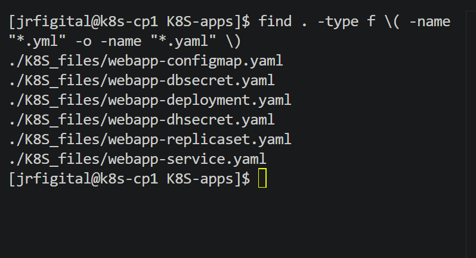
</p>

---

## 7. Construcción y publicación de la imagen Docker

El repositorio incluía el código fuente y el `Dockerfile`, pero para que Kubernetes pudiera ejecutar la aplicación era necesario construir una imagen Docker válida y publicarla en Docker Hub.

### Construcción de la imagen

```bash
docker build -t jrfigital2/webapp:v1 .
```

### Verificación de la imagen local

```bash
docker images
```

### Publicación en Docker Hub

```bash
docker login
docker push jrfigital2/webapp:v1
```

### Problema encontrado y solución

Durante el primer intento de despliegue, los pods quedaron en estado `InvalidImageName`. Al revisar los manifiestos YAML, se detectó que el nombre de la imagen estaba mal definido. Después de corregir la referencia y publicar correctamente la imagen en Docker Hub, el problema quedó solucionado.

También se verificó que la imagen quedara pública, de modo que Kubernetes pudiera descargarla sin necesidad de credenciales adicionales.

<p align="center">
  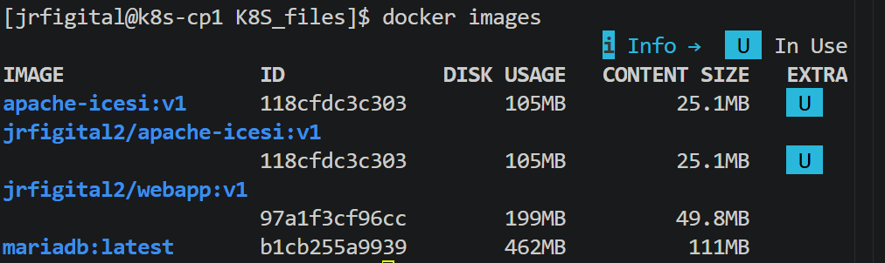
</p>

---

## 8. Ajuste del manifiesto Deployment

Luego de construir y publicar la imagen, fue necesario actualizar el archivo `webapp-deployment.yaml` para que Kubernetes utilizara la imagen correcta.

La referencia válida quedó configurada con la imagen publicada en Docker Hub.

### Ejemplo del cambio realizado

```yaml
image: jrfigital2/webapp:v1
```

Con esta corrección, el `Deployment` pudo crear los pods correctamente.

<p align="center">
  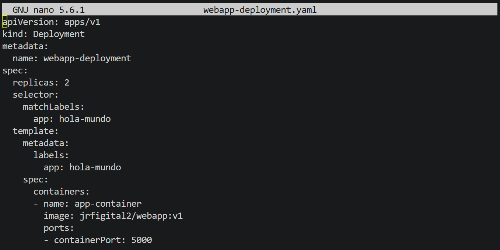
</p>

---

## 9. Despliegue de la aplicación

Una vez corregido el manifiesto, se aplicaron los recursos necesarios con:

```bash
kubectl apply -f K8S_files/webapp-deployment.yaml
kubectl apply -f K8S_files/webapp-service.yaml
```

Posteriormente, se verificó el estado del despliegue:

```bash
kubectl get deployments
kubectl get rs
kubectl get pods -o wide
kubectl get svc
```

El resultado fue exitoso:

- El `Deployment` quedó con `2/2` réplicas disponibles
- El `ReplicaSet` asociado quedó operativo
- Los pods se encontraron en estado `Running`
- El `Service` fue creado como `NodePort`

<p align="center">
  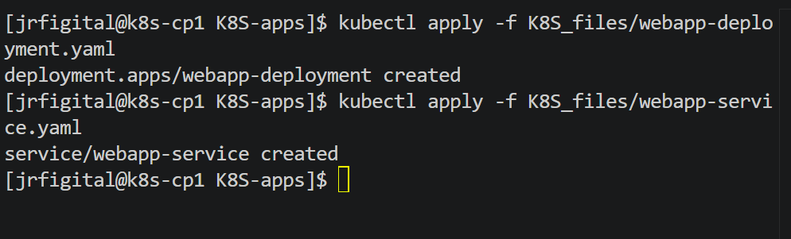
</p>

<p align="center">
  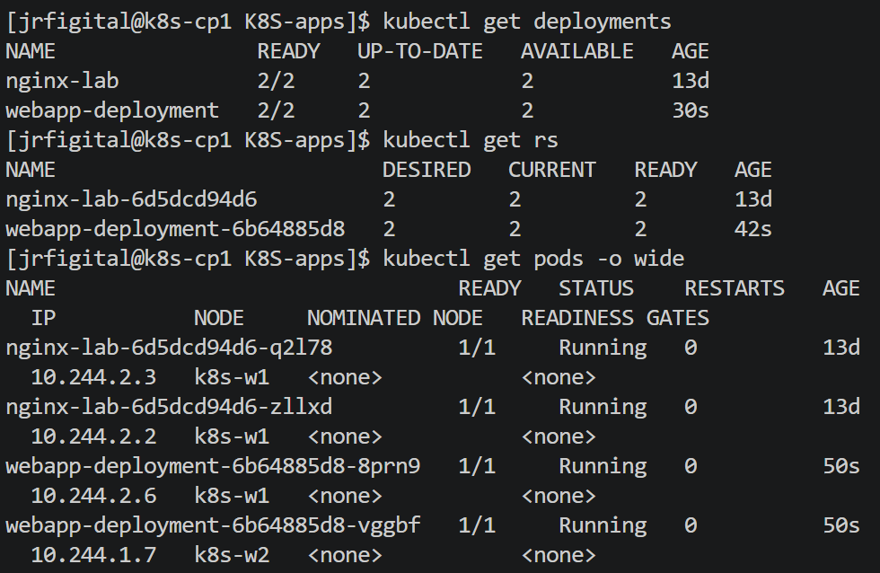
</p>

<p align="center">
  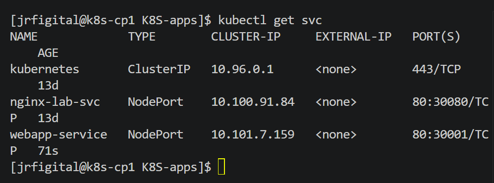
</p>

<p align="center">
  
</p>

---

## 10. Exposición de la aplicación

La aplicación fue expuesta mediante un `Service` de tipo `NodePort`, lo que permitió acceder a ella a través de la IP de uno de los nodos del clúster y del puerto asignado.

En este caso, el servicio quedó disponible en el puerto:

```bash
30001
```

Para comprobar el acceso, se utilizó la IP del nodo junto con ese puerto, verificando que la aplicación respondiera correctamente.

<p align="center">
  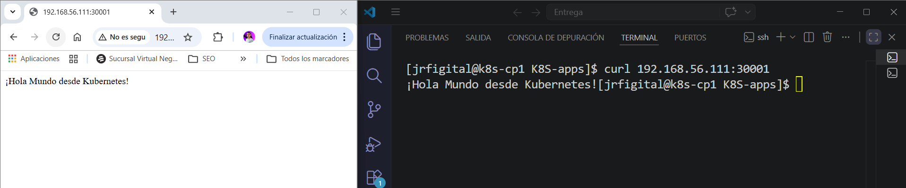
</p>

---

## 11. Escalamiento manual del Deployment

Una vez validado el despliegue inicial, se procedió a escalar manualmente la aplicación a 3 réplicas con el siguiente comando:

```bash
kubectl scale deployment webapp-deployment --replicas=3
```

Después se comprobó el resultado con:

```bash
kubectl get pods
kubectl get deployments
```

El escalamiento fue exitoso, ya que Kubernetes creó un tercer pod y el Deployment pasó a mantener tres réplicas activas.

<p align="center">
  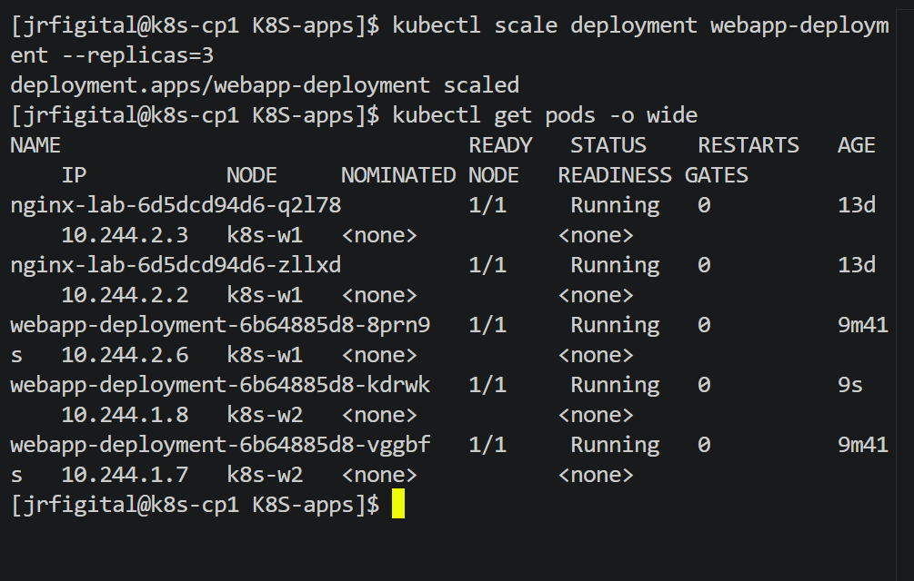
</p>

---

## 12. Prueba de resiliencia y self-healing

Para validar el comportamiento de auto-recuperación, se eliminó manualmente uno de los pods de la aplicación con:

```bash
kubectl delete pod <nombre-del-pod>
```

Luego se observó el comportamiento del clúster con:

```bash
kubectl get pods -w
```

### Resultado observado

Cuando uno de los pods fue eliminado, Kubernetes detectó que el número real de réplicas ya no coincidía con el número deseado definido en el Deployment. Automáticamente, el ReplicaSet asociado creó un nuevo pod para restaurar el estado esperado.

Este comportamiento demuestra el mecanismo de **self-healing** de Kubernetes.

<p align="center">
  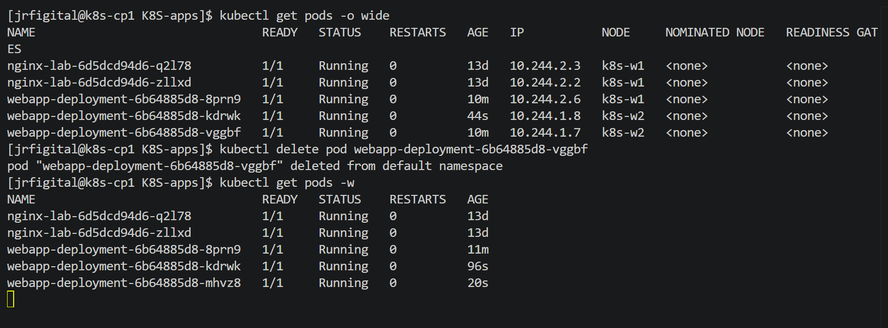
</p>

<p align="center">
  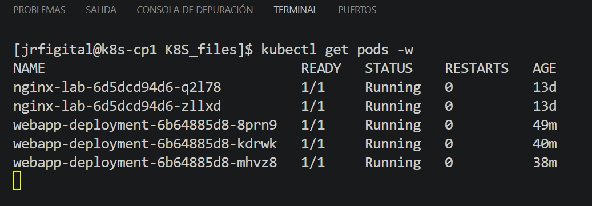
</p>

---

## 13. Resultados obtenidos

Durante el laboratorio se logró demostrar lo siguiente:

- Clúster Kubernetes funcional y operativo
- Aplicación desplegada correctamente
- Pods en estado `Running`
- Servicio accesible mediante `NodePort`
- Escalamiento exitoso a 3 pods
- Evidencia clara del mecanismo de auto-recuperación

Estos resultados coinciden con los objetivos y evidencias solicitadas en la guía del laboratorio.

---

## 14. Análisis técnico

Este laboratorio permitió comprender de forma práctica cómo Kubernetes administra aplicaciones contenerizadas sobre infraestructura propia, sin depender de plataformas administradas.

Se comprobó que:

- El `Deployment` facilita la administración del ciclo de vida de los pods
- El `Service` desacopla el acceso a la aplicación de la vida individual de los pods
- El escalamiento puede realizarse fácilmente con `kubectl scale`
- Kubernetes mantiene el estado deseado del sistema mediante ReplicaSets
- El self-healing es una de las características más importantes de la plataforma

Además, se presentó un error real durante el laboratorio relacionado con la referencia incorrecta de la imagen del contenedor, lo cual permitió reforzar la importancia de validar correctamente los manifiestos YAML antes del despliegue.

---

## 15. Conclusión

En esta práctica se desplegó exitosamente una aplicación contenerizada en un clúster Kubernetes construido con `kubeadm`, se expuso mediante un `Service`, se escaló manualmente y se comprobó el comportamiento de auto-recuperación del sistema.

La experiencia permitió no solo ejecutar comandos, sino entender la función de cada componente involucrado en el despliegue. También se resolvió un problema de configuración relacionado con la imagen del contenedor, lo cual aportó una visión más realista del trabajo operativo con Kubernetes.

En conclusión, el laboratorio permitió validar que Kubernetes no solo facilita el despliegue de aplicaciones, sino que además proporciona mecanismos robustos de disponibilidad, administración de réplicas y resiliencia ante fallos.

---

## 16. Comandos utilizados

```bash
git clone https://github.com/mariocr73/K8S-apps.git
cd K8S-apps

kubectl get nodes

docker build -t jrfigital2/webapp:v1 .
docker images
docker login
docker push jrfigital2/webapp:v1

kubectl apply -f K8S_files/webapp-deployment.yaml
kubectl apply -f K8S_files/webapp-service.yaml

kubectl get deployments
kubectl get rs
kubectl get pods -o wide
kubectl get svc

kubectl scale deployment webapp-deployment --replicas=3
kubectl get pods
kubectl get deployments

kubectl delete pod <nombre-del-pod>
kubectl get pods -w
```
